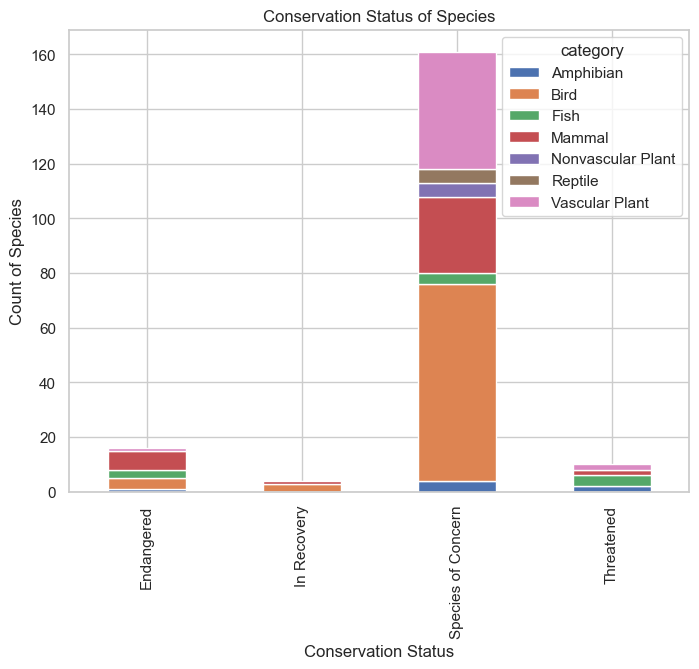
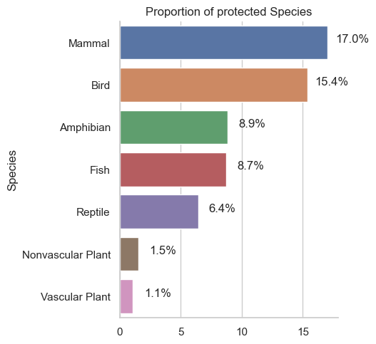
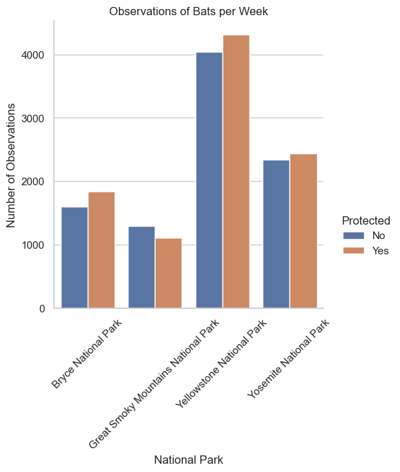

# Introduction

The goal of this project is to analyse biodiversity data from the National Parks Service, particularly around various species observed in different national park location.

This project will scope, analyze, prepare, plot data and seek to explain the findings from the analysis.

**Data sources**

Both `Observations.csv` and `Species_info.csv` was provided by [Codecademy.com](https://www.codecademy.com).

Note: The data for this project is *inspired* by real data, but is mostly fictional.

### Project Goals

In this project the perspective will be through a biodiversity analyst for the National Parks Service. The National Park Service wants to ensure the survival of at-risk species, to maintain the level of biodiversity within their parks. Therefore, the main objectives as an analyst will be understanding characteristics about the species and their conservations status, and those species and their relationship to the national parks. Some questions that are posed:

- What is the distribution of conservation status for species?
- Are certain types of species more likely to be endangered?
- Are the differences between species and their conservation status significant?
- Which animal is most prevalent and what is their distribution amongst parks?

### Data

This project has two data sets that came with the package. The first `csv` file has information about each species and another has observations of species with park locations. This data will be used to analyze the goals of the project.

### Analysis

In this section, descriptive statistics and data visualization techniques will be employed to understand the data better. Statistical inference will also be used to test if the observed values are statistically significant. Some of the key metrics that will be computed include:

1. Distributions
1. counts
1. relationship between species
1. conservation status of species
1. observations of species in parks.

### Evaluation

Lastly, it's a good idea to revisit the goals and check if the output of the analysis corresponds to the questions first set to be answered (in the goals section). This section will also reflect on what has been learned through the process, and if any of the questions were unable to be answered. This could also include limitations or if any of the analysis could have been done using different methodologies.


# Loading the Data

To analyze the status of conservation of species and their observations in national parks, load the datasets into `DataFrames`. Once loaded as `DataFrames` the data can be explored and visualized with Python.

In the next steps, `Observations.csv`  and `Species_info.csv` are read in as `DataFrames` called `observations` and `species` respectively. The newly created `DataFrames` are glimpsed with `.head()` and `.info()`to check its contents.


```python
import pandas as pd
import matplotlib.pyplot as plt
import seaborn as sns
from scipy.stats import chi2_contingency
sns.set_theme(style="whitegrid")
```


```python
observations = pd.read_csv("observations.csv")
species = pd.read_csv("species_info.csv")
```


```python
observations.head()
```


<div>
<style scoped>
    .dataframe tbody tr th:only-of-type {
        vertical-align: middle;
    }

    .dataframe tbody tr th {
        vertical-align: top;
    }

    .dataframe thead th {
        text-align: right;
    }
</style>
<table border="1" class="dataframe">
  <thead>
    <tr style="text-align: right;">
      <th></th>
      <th>scientific_name</th>
      <th>park_name</th>
      <th>observations</th>
    </tr>
  </thead>
  <tbody>
    <tr>
      <th>0</th>
      <td>Vicia benghalensis</td>
      <td>Great Smoky Mountains National Park</td>
      <td>68</td>
    </tr>
    <tr>
      <th>1</th>
      <td>Neovison vison</td>
      <td>Great Smoky Mountains National Park</td>
      <td>77</td>
    </tr>
    <tr>
      <th>2</th>
      <td>Prunus subcordata</td>
      <td>Yosemite National Park</td>
      <td>138</td>
    </tr>
    <tr>
      <th>3</th>
      <td>Abutilon theophrasti</td>
      <td>Bryce National Park</td>
      <td>84</td>
    </tr>
    <tr>
      <th>4</th>
      <td>Githopsis specularioides</td>
      <td>Great Smoky Mountains National Park</td>
      <td>85</td>
    </tr>
  </tbody>
</table>
</div>


```python
species.head()
```


<div>
<style scoped>
    .dataframe tbody tr th:only-of-type {
        vertical-align: middle;
    }

    .dataframe tbody tr th {
        vertical-align: top;
    }

    .dataframe thead th {
        text-align: right;
    }
</style>
<table border="1" class="dataframe">
  <thead>
    <tr style="text-align: right;">
      <th></th>
      <th>category</th>
      <th>scientific_name</th>
      <th>common_names</th>
      <th>conservation_status</th>
    </tr>
  </thead>
  <tbody>
    <tr>
      <th>0</th>
      <td>Mammal</td>
      <td>Clethrionomys gapperi gapperi</td>
      <td>Gapper's Red-Backed Vole</td>
      <td>NaN</td>
    </tr>
    <tr>
      <th>1</th>
      <td>Mammal</td>
      <td>Bos bison</td>
      <td>American Bison, Bison</td>
      <td>NaN</td>
    </tr>
    <tr>
      <th>2</th>
      <td>Mammal</td>
      <td>Bos taurus</td>
      <td>Aurochs, Aurochs, Domestic Cattle (Feral), Dom...</td>
      <td>NaN</td>
    </tr>
    <tr>
      <th>3</th>
      <td>Mammal</td>
      <td>Ovis aries</td>
      <td>Domestic Sheep, Mouflon, Red Sheep, Sheep (Feral)</td>
      <td>NaN</td>
    </tr>
    <tr>
      <th>4</th>
      <td>Mammal</td>
      <td>Cervus elaphus</td>
      <td>Wapiti Or Elk</td>
      <td>NaN</td>
    </tr>
  </tbody>
</table>
</div>


```python
observations.info()
```

    <class 'pandas.core.frame.DataFrame'>
    RangeIndex: 23296 entries, 0 to 23295
    Data columns (total 3 columns):
     #   Column           Non-Null Count  Dtype 
    ---  ------           --------------  ----- 
     0   scientific_name  23296 non-null  object
     1   park_name        23296 non-null  object
     2   observations     23296 non-null  int64 
    dtypes: int64(1), object(2)
    memory usage: 546.1+ KB
    


```python
species.info()
```

    <class 'pandas.core.frame.DataFrame'>
    RangeIndex: 5824 entries, 0 to 5823
    Data columns (total 4 columns):
     #   Column               Non-Null Count  Dtype 
    ---  ------               --------------  ----- 
     0   category             5824 non-null   object
     1   scientific_name      5824 non-null   object
     2   common_names         5824 non-null   object
     3   conservation_status  191 non-null    object
    dtypes: object(4)
    memory usage: 182.1+ KB
    

# Analysis

### 1. What is the distribution of conservation status for species?

Next steps is to check on the dataframe `species` conservation_status.

The column `conservation_status` has several possible values:
- `Species of Concern`: declining or appear to be in need of conservtion
- `Threatend`: vulnerable to endangerment in the near future
- `Endangered`: seriously at risk of extinction
- `In Recovery`:formerly `Endangered` but currently neither in danger of extinction all or a significant portion of its range

In the exploration, a lot of `nan` values were detected. These values will need to be converted to `No Intervention`


```python
species.conservation_status.value_counts()
```


    Species of Concern    161
    Endangered             16
    Threatened             10
    In Recovery             4
    Name: conservation_status, dtype: int64


```python
print("NAN values: ", species.conservation_status.isna().sum())
```

    NAN values:  5633
    


```python
species.fillna("No Intervention", inplace=True)
species.conservation_status.value_counts()
```


    No Intervention       5633
    Species of Concern     161
    Endangered              16
    Threatened              10
    In Recovery              4
    Name: conservation_status, dtype: int64


Next step is to checkout the different categories that are nested in the `conservation status` column except for the ones that do not require an intervention.


```python
species_conservation = species[species.conservation_status != "No Intervention"].groupby(["conservation_status", "category"])["scientific_name"].count().unstack()

print(species_conservation)
```

    category             Amphibian  Bird  Fish  Mammal  Nonvascular Plant  \
    conservation_status                                                     
    Endangered                 1.0   4.0   3.0     7.0                NaN   
    In Recovery                NaN   3.0   NaN     1.0                NaN   
    Species of Concern         4.0  72.0   4.0    28.0                5.0   
    Threatened                 2.0   NaN   4.0     2.0                NaN   
    
    category             Reptile  Vascular Plant  
    conservation_status                           
    Endangered               NaN             1.0  
    In Recovery              NaN             NaN  
    Species of Concern       5.0            43.0  
    Threatened               NaN             2.0  
    


```python
ax = species_conservation.plot(kind="bar", stacked=True, figsize=(8,6))

ax.set_xlabel("Conservation Status")
ax.set_ylabel("Count of Species")
ax.set_title("Conservation Status of Species")

plt.show()
plt.close()
```


    

    


### 2. Are certain types of species more likely to be endangered?

17.05 and 15.37 percent of Mammals respectively of Birds are protected.


```python
species["is_protected"] = species.conservation_status != "No Intervention"
```


```python
#groupby
category_counts = species.groupby(["category", "is_protected"]).scientific_name.nunique().reset_index()

#create pivot table
category_counts = pd.pivot(category_counts, index="category", columns="is_protected", values="scientific_name").reset_index()

category_counts.columns = ["species", "not_protected", "protected"]

#add percent column
category_counts["percent_protected"] = (category_counts.protected/(category_counts.not_protected + category_counts.protected))*100


category_counts = category_counts.sort_values('percent_protected', ascending=False).reset_index(drop=True)
category_counts
```


<div>
<style scoped>
    .dataframe tbody tr th:only-of-type {
        vertical-align: middle;
    }

    .dataframe tbody tr th {
        vertical-align: top;
    }

    .dataframe thead th {
        text-align: right;
    }
</style>
<table border="1" class="dataframe">
  <thead>
    <tr style="text-align: right;">
      <th></th>
      <th>species</th>
      <th>not_protected</th>
      <th>protected</th>
      <th>percent_protected</th>
    </tr>
  </thead>
  <tbody>
    <tr>
      <th>0</th>
      <td>Mammal</td>
      <td>146</td>
      <td>30</td>
      <td>17.045455</td>
    </tr>
    <tr>
      <th>1</th>
      <td>Bird</td>
      <td>413</td>
      <td>75</td>
      <td>15.368852</td>
    </tr>
    <tr>
      <th>2</th>
      <td>Amphibian</td>
      <td>72</td>
      <td>7</td>
      <td>8.860759</td>
    </tr>
    <tr>
      <th>3</th>
      <td>Fish</td>
      <td>115</td>
      <td>11</td>
      <td>8.730159</td>
    </tr>
    <tr>
      <th>4</th>
      <td>Reptile</td>
      <td>73</td>
      <td>5</td>
      <td>6.410256</td>
    </tr>
    <tr>
      <th>5</th>
      <td>Nonvascular Plant</td>
      <td>328</td>
      <td>5</td>
      <td>1.501502</td>
    </tr>
    <tr>
      <th>6</th>
      <td>Vascular Plant</td>
      <td>4216</td>
      <td>46</td>
      <td>1.079305</td>
    </tr>
  </tbody>
</table>
</div>


```python
plot = sns.catplot(data=category_counts, y="species", x="percent_protected", kind="bar", orient="h")

plt.title("Proportion of protected Species")
plt.xlabel("")
plt.ylabel("Species")

#display the values above each bar
for index, row in category_counts.iterrows():
    plot.ax.text(y=index, x=row["percent_protected"]+2, s=f"{row['percent_protected']:.1f}%", ha="center")

plt.show()
plt.close()
```


    

    


### 3. Are the differences between species and their conservation status significant?

The differences between species and their conservation status are significant based on the Chi-squared test results with a p-value of 1.88e-148. This indicates that there is a strong association between the species and their conservation status.


```python

category_counts_new = category_counts.drop(columns="species")
chi2_contingency(category_counts_new)
```


    Chi2ContingencyResult(statistic=729.747651722012, pvalue=1.8828638639935904e-148, dof=12, expected_freq=array([[1.84842610e+02, 6.16946246e+00, 2.03338206e+00],
           [4.81979815e+02, 1.60869638e+01, 5.30207352e+00],
           [8.41273996e+01, 2.80790687e+00, 9.25452984e-01],
           [1.29005235e+02, 4.30578725e+00, 1.41913669e+00],
           [8.08235146e+01, 2.69763362e+00, 8.89108222e-01],
           [3.20287938e+02, 1.06901997e+01, 3.52336372e+00],
           [4.08193349e+03, 1.36242046e+02, 4.49037714e+01]]))


### Which animal is most prevalent and what is their distribution amongst parks?

The next set of analysis will come from data from the conservationists as they have been recording sightings of different species at several national parks for the past 7 days.

The first step is to look at the common names from `species` to get an idea of the most prevalent animals in the dataset. The data will be need to be split up into individual names.


```python
from itertools import chain
import string

def remove_punctuation(text):
    for punctuation in string.punctuation:
        text = text.replace(punctuation, "")
    return text

common_names = species[species["category"] == "Mammal"].common_names.apply(remove_punctuation).str.split(" ").tolist()


common_names[:6]
```


    [['Gappers', 'RedBacked', 'Vole'],
     ['American', 'Bison', 'Bison'],
     ['Aurochs',
      'Aurochs',
      'Domestic',
      'Cattle',
      'Feral',
      'Domesticated',
      'Cattle'],
     ['Domestic', 'Sheep', 'Mouflon', 'Red', 'Sheep', 'Sheep', 'Feral'],
     ['Wapiti', 'Or', 'Elk'],
     ['WhiteTailed', 'Deer']]


```python
#remove Duplicates
common_names_clean = []

for item in common_names:
    common_names_clean.append(list(set(item)))

common_names_clean[:6]
```


    [['Gappers', 'RedBacked', 'Vole'],
     ['Bison', 'American'],
     ['Domesticated', 'Aurochs', 'Cattle', 'Feral', 'Domestic'],
     ['Red', 'Sheep', 'Feral', 'Mouflon', 'Domestic'],
     ['Elk', 'Or', 'Wapiti'],
     ['Deer', 'WhiteTailed']]


```python
#transform into flat list
import itertools
common_names_flat = list(itertools.chain(*common_names_clean))

common_names_flat[:12]
```


    ['Gappers',
     'RedBacked',
     'Vole',
     'Bison',
     'American',
     'Domesticated',
     'Aurochs',
     'Cattle',
     'Feral',
     'Domestic',
     'Red',
     'Sheep']


```python
#count names
from collections import Counter
common_names_count = Counter(common_names_flat)

print(common_names_count)
```

    Counter({'Bat': 23, 'Shrew': 18, 'Myotis': 17, 'Mouse': 16, 'Chipmunk': 13, 'American': 12, 'Squirrel': 12, 'Vole': 11, 'Eastern': 11, 'Mountain': 10, 'Western': 10, 'Red': 8, 'Gray': 8, 'Northern': 8, 'Common': 7, 'Fox': 6, 'Brown': 6, 'California': 6, 'Feral': 5, 'Deer': 5, 'BigEared': 5, 'Cottontail': 5, 'Southern': 5, 'Woodrat': 5, 'Ground': 5, 'Or': 4, 'WhiteTailed': 4, 'Wolf': 4, 'Black': 4, 'Lion': 4, 'Skunk': 4, 'Spotted': 4, 'Weasel': 4, 'Mink': 4, 'LongTailed': 4, 'Least': 4, 'Bear': 4, 'LongEared': 4, 'Beaver': 4, 'Rat': 4, 'Mole': 4, 'Pocket': 4, 'Sierra': 4, 'Nevada': 4, 'Sheep': 3, 'Elk': 3, 'Wild': 3, 'Otter': 3, 'River': 3, 'Raccoon': 3, 'SmallFooted': 3, 'Little': 3, 'Meadow': 3, 'Jumping': 3, 'Flying': 3, 'Water': 3, 'Rocky': 3, 'Deermouse': 3, 'Gopher': 3, 'Uinta': 3, 'RedBacked': 2, 'Bison': 2, 'Domestic': 2, 'Pig': 2, 'Fisher': 2, 'Big': 2, 'SilverHaired': 2, 'Hoary': 2, 'Southeastern': 2, 'Virginia': 2, 'Opossum': 2, 'Snowshoe': 2, 'Hare': 2, 'Appalachian': 2, 'Rock': 2, 'Woodland': 2, 'Muskrat': 2, 'Marsh': 2, 'Rice': 2, 'Harvest': 2, 'Bog': 2, 'Lemming': 2, 'Porcupine': 2, 'Short': 2, 'Tailed': 2, 'Masked': 2, 'Pygmy': 2, 'Bighorn': 2, 'Moose': 2, 'Marten': 2, 'Pine': 2, 'Ermine': 2, 'Badger': 2, 'Grizzly': 2, 'Townsends': 2, 'Jackrabbit': 2, 'Rabbit': 2, 'Pika': 2, 'Montane': 2, 'GoldenMantled': 2, 'Brush': 2, 'Inyo': 2, 'Gappers': 1, 'Domesticated': 1, 'Aurochs': 1, 'Cattle': 1, 'Mouflon': 1, 'Wapiti': 1, 'Hog': 1, 'Coyote': 1, 'Silver': 1, 'Cross': 1, 'Wildcat': 1, 'Cat': 1, 'Bobcat': 1, 'Panther': 1, 'Striped': 1, 'Rafinesques': 1, 'Mississippi': 1, 'Keens': 1, 'Social': 1, 'Indiana': 1, 'Evening': 1, 'Pipistrelle': 1, 'Oppossum': 1, 'New': 1, 'England': 1, 'Horse': 1, 'Human': 1, 'Man': 1, 'Humans': 1, 'Allegheny': 1, 'Golden': 1, 'Cotton': 1, 'WhiteFooted': 1, 'Stones': 1, 'House': 1, 'Norway': 1, 'Carolina': 1, 'Woodchuck': 1, 'ShortTailed': 1, 'Smoky': 1, 'StarNosed': 1, 'HairyTailed': 1, 'Antelope': 1, 'Pronghorn': 1, 'Buffalo': 1, 'Goat': 1, 'Eurasian': 1, 'Yellowstone': 1, 'Mule': 1, 'Lynx': 1, 'Canada': 1, 'Canadian': 1, 'Cougar': 1, 'Puma': 1, 'Wolverine': 1, 'Pallid': 1, 'MuleEared': 1, 'Pacific': 1, 'LumpNosed': 1, 'Californian': 1, 'Fringed': 1, 'LongLegged': 1, 'Yuma': 1, 'Jack': 1, 'Desert': 1, 'Sagebrush': 1, 'Coronation': 1, 'Island': 1, 'Richardson': 1, 'BushyTailed': 1, 'Muskbeaver': 1, 'North': 1, 'Heather': 1, 'YellowBellied': 1, 'Marmot': 1, 'Yellow': 1, 'YellowPine': 1, 'Cinereus': 1, 'Dusky': 1, 'Dwarf': 1, 'Malheur': 1, 'Prebles': 1, 'Boar': 1, 'Ringtail': 1, 'Mastiff': 1, 'Mexican': 1, 'FreeTailed': 1, 'Canyon': 1, 'Pinyon': 1, 'PiOn': 1, 'Bottas': 1, 'Alpine': 1, 'Merriams': 1, 'Allens': 1, 'Shadow': 1, 'Lodgepole': 1, 'Chickaree': 1, 'Beldings': 1, 'Mount': 1, 'Lyell': 1, 'Trowbridges': 1, 'BroadFooted': 1})
    

Now the data is ready to be able to count the number of occurences of each word. With 23 counts the word `Bat` is the most mentioned animal of type "Mammal"

In the data, there are several different scientific names for different types of bat. The next task is to figure out which rows of species are referring to bats.


```python
#create new column is_bat
species["is_bat"] = species.common_names.str.contains(r"\bBat\b",case=False, regex=True)

species
```


<div>
<style scoped>
    .dataframe tbody tr th:only-of-type {
        vertical-align: middle;
    }

    .dataframe tbody tr th {
        vertical-align: top;
    }

    .dataframe thead th {
        text-align: right;
    }
</style>
<table border="1" class="dataframe">
  <thead>
    <tr style="text-align: right;">
      <th></th>
      <th>category</th>
      <th>scientific_name</th>
      <th>common_names</th>
      <th>conservation_status</th>
      <th>is_protected</th>
      <th>is_bat</th>
    </tr>
  </thead>
  <tbody>
    <tr>
      <th>0</th>
      <td>Mammal</td>
      <td>Clethrionomys gapperi gapperi</td>
      <td>Gapper's Red-Backed Vole</td>
      <td>No Intervention</td>
      <td>False</td>
      <td>False</td>
    </tr>
    <tr>
      <th>1</th>
      <td>Mammal</td>
      <td>Bos bison</td>
      <td>American Bison, Bison</td>
      <td>No Intervention</td>
      <td>False</td>
      <td>False</td>
    </tr>
    <tr>
      <th>2</th>
      <td>Mammal</td>
      <td>Bos taurus</td>
      <td>Aurochs, Aurochs, Domestic Cattle (Feral), Dom...</td>
      <td>No Intervention</td>
      <td>False</td>
      <td>False</td>
    </tr>
    <tr>
      <th>3</th>
      <td>Mammal</td>
      <td>Ovis aries</td>
      <td>Domestic Sheep, Mouflon, Red Sheep, Sheep (Feral)</td>
      <td>No Intervention</td>
      <td>False</td>
      <td>False</td>
    </tr>
    <tr>
      <th>4</th>
      <td>Mammal</td>
      <td>Cervus elaphus</td>
      <td>Wapiti Or Elk</td>
      <td>No Intervention</td>
      <td>False</td>
      <td>False</td>
    </tr>
    <tr>
      <th>...</th>
      <td>...</td>
      <td>...</td>
      <td>...</td>
      <td>...</td>
      <td>...</td>
      <td>...</td>
    </tr>
    <tr>
      <th>5819</th>
      <td>Vascular Plant</td>
      <td>Solanum parishii</td>
      <td>Parish's Nightshade</td>
      <td>No Intervention</td>
      <td>False</td>
      <td>False</td>
    </tr>
    <tr>
      <th>5820</th>
      <td>Vascular Plant</td>
      <td>Solanum xanti</td>
      <td>Chaparral Nightshade, Purple Nightshade</td>
      <td>No Intervention</td>
      <td>False</td>
      <td>False</td>
    </tr>
    <tr>
      <th>5821</th>
      <td>Vascular Plant</td>
      <td>Parthenocissus vitacea</td>
      <td>Thicket Creeper, Virginia Creeper, Woodbine</td>
      <td>No Intervention</td>
      <td>False</td>
      <td>False</td>
    </tr>
    <tr>
      <th>5822</th>
      <td>Vascular Plant</td>
      <td>Vitis californica</td>
      <td>California Grape, California Wild Grape</td>
      <td>No Intervention</td>
      <td>False</td>
      <td>False</td>
    </tr>
    <tr>
      <th>5823</th>
      <td>Vascular Plant</td>
      <td>Tribulus terrestris</td>
      <td>Bullhead, Caltrop, Goathead, Mexican Sandbur, ...</td>
      <td>No Intervention</td>
      <td>False</td>
      <td>False</td>
    </tr>
  </tbody>
</table>
<p>5824 rows × 6 columns</p>
</div>


The results of the bat species will be merged with `observations` to create a `Dataframe` with observations of bats across the four national parks.


```python
bat_observations = observations.merge(species[species.is_bat])
bat_observations
```


<div>
<style scoped>
    .dataframe tbody tr th:only-of-type {
        vertical-align: middle;
    }

    .dataframe tbody tr th {
        vertical-align: top;
    }

    .dataframe thead th {
        text-align: right;
    }
</style>
<table border="1" class="dataframe">
  <thead>
    <tr style="text-align: right;">
      <th></th>
      <th>scientific_name</th>
      <th>park_name</th>
      <th>observations</th>
      <th>category</th>
      <th>common_names</th>
      <th>conservation_status</th>
      <th>is_protected</th>
      <th>is_bat</th>
    </tr>
  </thead>
  <tbody>
    <tr>
      <th>0</th>
      <td>Lasiurus blossevillii</td>
      <td>Bryce National Park</td>
      <td>113</td>
      <td>Mammal</td>
      <td>Western Red Bat</td>
      <td>Species of Concern</td>
      <td>True</td>
      <td>True</td>
    </tr>
    <tr>
      <th>1</th>
      <td>Lasiurus blossevillii</td>
      <td>Great Smoky Mountains National Park</td>
      <td>70</td>
      <td>Mammal</td>
      <td>Western Red Bat</td>
      <td>Species of Concern</td>
      <td>True</td>
      <td>True</td>
    </tr>
    <tr>
      <th>2</th>
      <td>Lasiurus blossevillii</td>
      <td>Yosemite National Park</td>
      <td>123</td>
      <td>Mammal</td>
      <td>Western Red Bat</td>
      <td>Species of Concern</td>
      <td>True</td>
      <td>True</td>
    </tr>
    <tr>
      <th>3</th>
      <td>Lasiurus blossevillii</td>
      <td>Yellowstone National Park</td>
      <td>221</td>
      <td>Mammal</td>
      <td>Western Red Bat</td>
      <td>Species of Concern</td>
      <td>True</td>
      <td>True</td>
    </tr>
    <tr>
      <th>4</th>
      <td>Corynorhinus rafinesquii</td>
      <td>Yosemite National Park</td>
      <td>188</td>
      <td>Mammal</td>
      <td>Rafinesque's Big-Eared Bat</td>
      <td>No Intervention</td>
      <td>False</td>
      <td>True</td>
    </tr>
    <tr>
      <th>...</th>
      <td>...</td>
      <td>...</td>
      <td>...</td>
      <td>...</td>
      <td>...</td>
      <td>...</td>
      <td>...</td>
      <td>...</td>
    </tr>
    <tr>
      <th>139</th>
      <td>Myotis sodalis</td>
      <td>Yellowstone National Park</td>
      <td>68</td>
      <td>Mammal</td>
      <td>Indiana Bat, Indiana Or Social Myotis</td>
      <td>Endangered</td>
      <td>True</td>
      <td>True</td>
    </tr>
    <tr>
      <th>140</th>
      <td>Myotis leibii</td>
      <td>Yosemite National Park</td>
      <td>132</td>
      <td>Mammal</td>
      <td>Eastern Small-Footed Bat, Eastern Small-Footed...</td>
      <td>Species of Concern</td>
      <td>True</td>
      <td>True</td>
    </tr>
    <tr>
      <th>141</th>
      <td>Myotis leibii</td>
      <td>Bryce National Park</td>
      <td>84</td>
      <td>Mammal</td>
      <td>Eastern Small-Footed Bat, Eastern Small-Footed...</td>
      <td>Species of Concern</td>
      <td>True</td>
      <td>True</td>
    </tr>
    <tr>
      <th>142</th>
      <td>Myotis leibii</td>
      <td>Great Smoky Mountains National Park</td>
      <td>49</td>
      <td>Mammal</td>
      <td>Eastern Small-Footed Bat, Eastern Small-Footed...</td>
      <td>Species of Concern</td>
      <td>True</td>
      <td>True</td>
    </tr>
    <tr>
      <th>143</th>
      <td>Myotis leibii</td>
      <td>Yellowstone National Park</td>
      <td>233</td>
      <td>Mammal</td>
      <td>Eastern Small-Footed Bat, Eastern Small-Footed...</td>
      <td>Species of Concern</td>
      <td>True</td>
      <td>True</td>
    </tr>
  </tbody>
</table>
<p>144 rows × 8 columns</p>
</div>


Subset Bats along parks and whether they are protected or not


```python
bat_by_park = bat_observations.groupby(["park_name", "is_protected"]).observations.sum().reset_index()

bat_by_park
```


<div>
<style scoped>
    .dataframe tbody tr th:only-of-type {
        vertical-align: middle;
    }

    .dataframe tbody tr th {
        vertical-align: top;
    }

    .dataframe thead th {
        text-align: right;
    }
</style>
<table border="1" class="dataframe">
  <thead>
    <tr style="text-align: right;">
      <th></th>
      <th>park_name</th>
      <th>is_protected</th>
      <th>observations</th>
    </tr>
  </thead>
  <tbody>
    <tr>
      <th>0</th>
      <td>Bryce National Park</td>
      <td>False</td>
      <td>1596</td>
    </tr>
    <tr>
      <th>1</th>
      <td>Bryce National Park</td>
      <td>True</td>
      <td>1837</td>
    </tr>
    <tr>
      <th>2</th>
      <td>Great Smoky Mountains National Park</td>
      <td>False</td>
      <td>1299</td>
    </tr>
    <tr>
      <th>3</th>
      <td>Great Smoky Mountains National Park</td>
      <td>True</td>
      <td>1112</td>
    </tr>
    <tr>
      <th>4</th>
      <td>Yellowstone National Park</td>
      <td>False</td>
      <td>4044</td>
    </tr>
    <tr>
      <th>5</th>
      <td>Yellowstone National Park</td>
      <td>True</td>
      <td>4318</td>
    </tr>
    <tr>
      <th>6</th>
      <td>Yosemite National Park</td>
      <td>False</td>
      <td>2345</td>
    </tr>
    <tr>
      <th>7</th>
      <td>Yosemite National Park</td>
      <td>True</td>
      <td>2441</td>
    </tr>
  </tbody>
</table>
</div>


Below is a plot from the output of the last data manipulation. From this chart one can see that Yellowstone and Bryce National Parks seem to be doing a great job with their bat populations since there are more sightings of protected bats compared to non-protected species. The Great Smoky Mountains National Park might need to beef up there efforts in conservation as they have seen more non-protected species.


```python
plt.figure(figsize=(16,6))

plot = sns.catplot(data = bat_by_park, x="park_name", y="observations", hue="is_protected", kind="bar")

plt.title("Observations of Bats per Week")
plt.ylabel("Number of Observations")
plt.xlabel("National Park")
plot.set_xticklabels(rotation=45)
plot._legend.set_title("Protected")
new_labels = ["No", "Yes"]
for t, l in zip(plot._legend.texts, new_labels): t.set_text(l)

plt.show()
plt.close()
```


    <Figure size 1600x600 with 0 Axes>


    

    


## Conclusions

The project was able to make several data visualizations and inferences about the various species in four of the National Parks that comprised this data set.

This project was also able to answer some of the questions first posed in the beginning:

- What is the distribution of conservation status for species?
    - The vast majority of species were not part of conservation.(5,633 vs 191)
- Are certain types of species more likely to be endangered?
    - Mammals and Birds had the highest percentage of being in protection.
- Are the differences between species and their conservation status significant?
    - While mammals and Birds did not have significant difference in conservation percentage, mammals and reptiles exhibited a statistically significant difference.
- Which animal is most prevalent and what is their distribution amongst parks?
    - the study found that bats occurred the most number of times and they were most likely to be found in Yellowstone National Park.

## Further Research

This dataset only included observations from the last 7 days which prohibits analyze changes over time. It would be curious to see how the conservation status for various species changes over time. Another piece that is missing is the Area of each park, it can be assumed that Yellowstone National Park might be much larger than the other parks which would mean that it would exhibit more observations and greater biodiversity. Lastly, if precise locations were recorded, the spatial distribution of the species could also be observed and test if these observations are spatially clustered.
